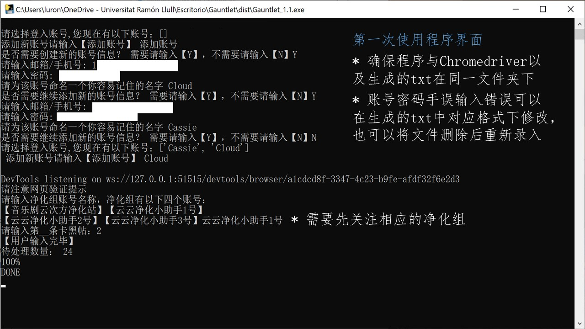

# 使用说明
+ 需将整份文件夹下载至本地，切勿删除任何原始文件

+ exe程序位于dist文件夹下，根据指令操作即可

## 环境配置
+ Chrome浏览器
+ [ChromeDiver](https://chromedriver.chromium.org/downloads)

## 操作界面
+ 第一次使用时根据指令创建账号文件，在使用过程中确保txt文件、chromediver和exe文件位于同一文件夹下

+ 卡黑条目如图所示
从第一条微博向下数，第二条为卡黑博则输入2  
 

+ 后续使用中注意程序进入第一次卡黑条目时登录界面操作

