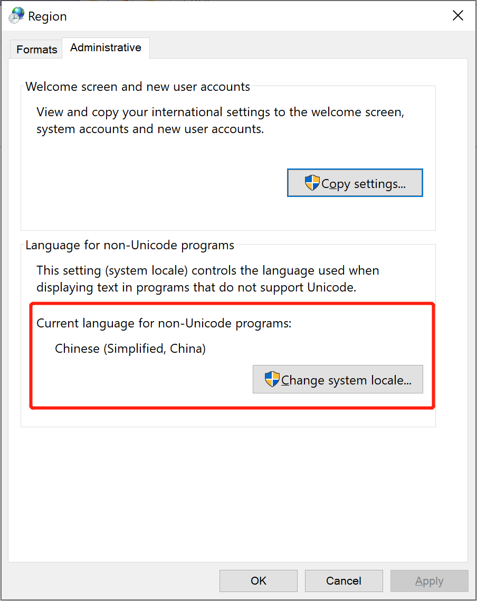
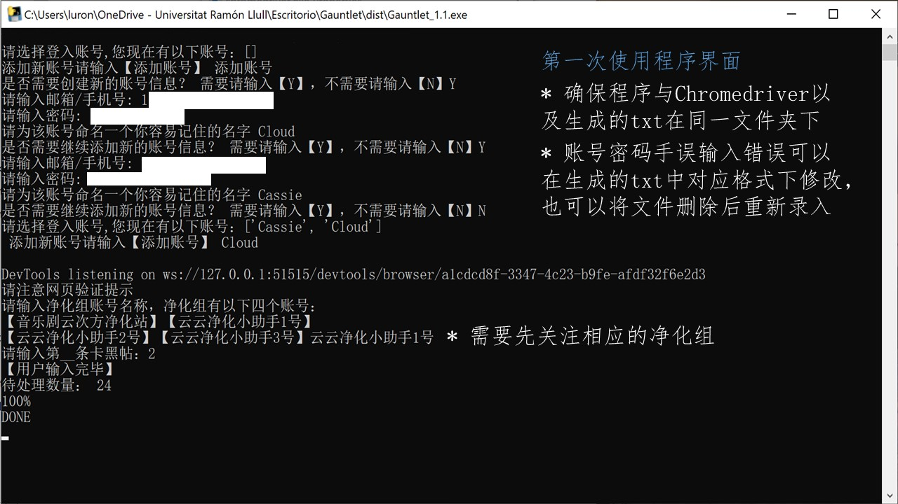
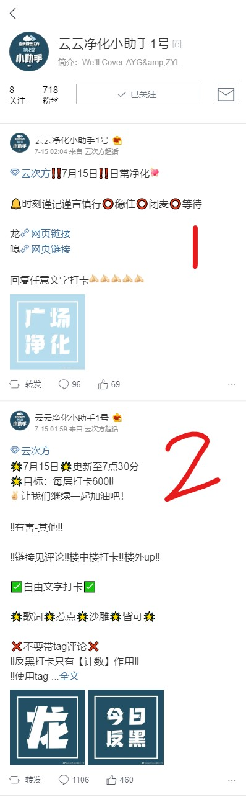
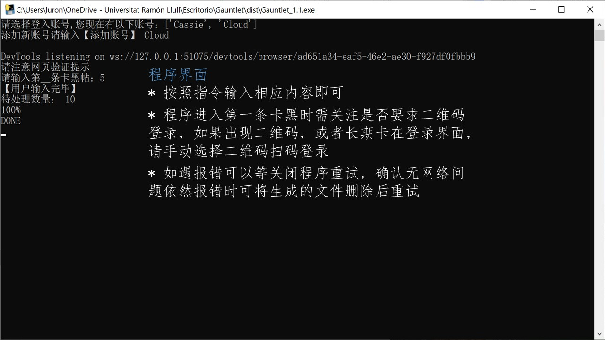

# Gauntlet 卡黑

 
*莫嚣张，有位骑士已刺出长枪*  
*And a knight with his banners all bravely unfurled*  
*惩恶扬善游侠四方*  
*Now hurls down his gauntlet to thee*  
*——《我，堂吉诃德》*

## 功能说明  
* 1.0:（2020.6.26.\[2020.7.13.更新\])  
>1. 查找“音乐剧云次方净化站”和“云云净化小助手n号”第k条卡黑帖 
>2. 识别“音乐剧云次方净化站”和“云云净化小助手n号”卡黑格式，点开第k条中所有链接进行卡黑举报（目前所有举报仅提供"有害-其他"）
* 1.1:（2020.7.17.)  
>打包封装，简化环境配置
* 1.2:（2020.7.27.)  
  新增:  
>3. 卡黑帖楼中楼打卡功能  
>4. 可不退出重新选择其他卡黑帖继续

## 环境配置
+ Chrome浏览器(83版本)

## 操作步骤
1. 下载文件  
* 点击绿色clone图标，下载文件，其中Mac系统保留Gauntlet_1-2_Mac文件夹，Windows系统保留Gauntlet_1.2_Win文件夹即可，文件夹内其他内容请勿删除  
* 在使用过程中请勿移动任何文件位置
* 如果下载速度过慢可以使用下面的百度网盘链接下载
  [链接](https://pan.baidu.com/s/1hfEtlK8FfGXQCTNxvNlYCw) 提取码：`tke1`  
2. 预先设置
    #### Windows
   + 检查系统locale是否中文: 控制面板(Control Panel)-> 区域(Region)-> 管理(administrative)->非Unicode程序中所使用的当前语言(Current language for non-Unicode programs)为中文（简体，中国）  
  如果为其他语言区域请先改为中文  
        

   + 直接点击Gauntlet_1-2_win.exe打开，出现输入提示

    #### Mac
   + 打开Gauntlet_1-2_Mac文件夹，点击图标右键->显示包内容
   + 打开Contents 文件夹，打开MacOS文件夹
   + 直接点击Gauntlet_1-2_mac.exe打开，出现输入提示
3. 输入示例
+ 第一次使用时根据指令创建账号文件（此时提示现有账号为\[ \]）；
  * 新建账号时自行命名账号简称（方便记忆即可，如Cloud）
  * 提示输入账号信息时，邮箱/手机号和密码为用户的微博账号密码
    

+ 卡黑条目如图所示
从第一条微博向下数，第二条为卡黑博则输入2  
    

+ 如果中途浏览器弹出微博首页，注意右上角扫码登录，手机扫码即可
    

+ 后续使用中注意程序进入第一次卡黑条目时登录界面操作
    

## 补充说明
1. 目前该程序识别“音乐剧云次方净化站”和“云云净化小助手n号”，仅能处理“有害-其他”，如果有其他举报（一般情况较少）烦请手动操作
2. 请手动楼外up(已设置20s等待时间)
3. 可自动运行，但不可将浏览器最小化
4. 如果出现浏览器意外退出情况，请多次尝试

## 待补充功能
1. 其他浏览器开发
